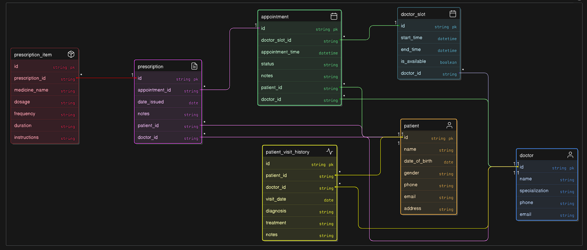
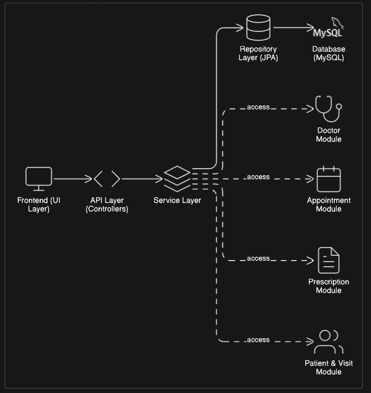

# 🏥 Hospital Management System — Project Documentation

## 📘 Project Overview
The **Hospital Management System** is a Spring Boot application designed to manage hospital operations such as doctor scheduling, appointments, prescriptions, and patient visit management.

## 🎯 Objectives
- Automate hospital processes.
- Ensure efficient coordination between doctors and patients.
- Maintain accurate medical histories.
- Enforce relational data integrity.

## ⚙️ Tech Stack
| Layer | Technology |
|-------|-------------|
| Backend | Spring Boot, Spring Data JPA |
| Database | MySQL |
| Build Tool | Maven |
| Language | Java 17 |

## 🧩 Core Modules
### Doctor Management
- Manage doctor profiles including name, specialization, and contact info.
- Each doctor can have multiple time slots assigned daily.
- Connected to `DoctorSlot` and `Appointment` entities.

### Patient Management
- Manages patient information and stores demographic and contact details.
- Connected to appointments and visit history.

### Doctor Slot Management
- Automatically generates available time slots for each doctor.
- Slots are linked to doctors by date and availability.
- Includes endpoints for:
    - Slot generation
    - Retrieving available slots
    - Slot deletion by date.
  
### Appointment Management
- Handles booking of appointments between patients and doctors.
- Validates doctor slot availability before confirming.
- Automatically marks slots as unavailable when booked.
- Appointment status (`SCHEDULED`, `COMPLETED`) updates automatically upon prescription creation.

### Prescription Management
- Allows doctors to issue prescriptions tied to specific appointments.
- Each prescription includes multiple medicines (`PrescriptionItem`).
- Automatically updates appointment status to `Completed` when a prescription is created.
- Cascade delete ensures associated medicines are deleted when a prescription is removed.

### Patient Visit History [Upcoming]
- Displays a complete record of patient visits and treatments.
- Aggregates data from appointments, doctors, and prescriptions.
- Will serve as a long-term reference for patient medical history.

### Audit Log (System Level) [Upcoming]
- Tracks creation, updates, and deletions across major entities.
- Useful for administrative tracking and debugging.

## 🗄️ Database Tables
| Table Name | Description |
|-------------|-------------|
| doctor | Stores doctor information |
| doctor_slot | Holds generated time slots |
| patient | Stores patient details |
| appointment | Connects doctors, patients, and slots |
| prescription | Prescription for a completed appointment |
| prescription_item | Medicines within a prescription |
| patient_visit_history | Tracks past visits |
| audit_log | Logs CRUD operations |

## 🧬 ER Diagram (Structure)

https://app.eraser.io/workspace/DY8gW5F3HDWWJxUbC2Fn?origin=share
## 🧭 High-Level Architecture (HLD)

https://app.eraser.io/workspace/tcxPmL0DkmwLtnWccxLR?origin=share

## 📅 Future Enhancements
- Implement Soft Delete for connected entities.
- Add JWT-based Authentication.
- Expand Visit History module.
- Integrate Email/SMS notifications.
